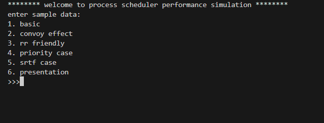
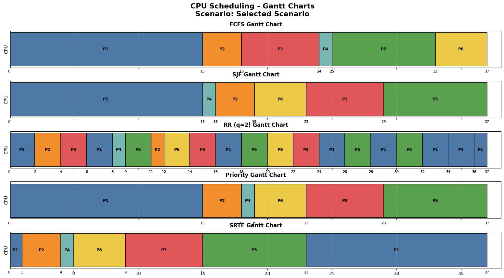
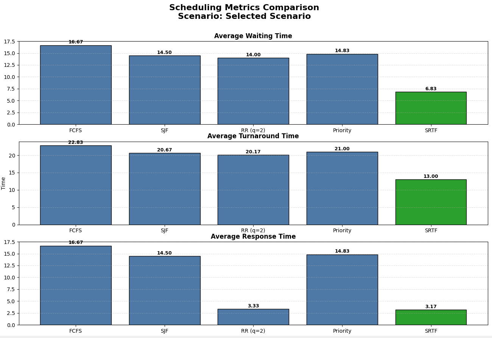
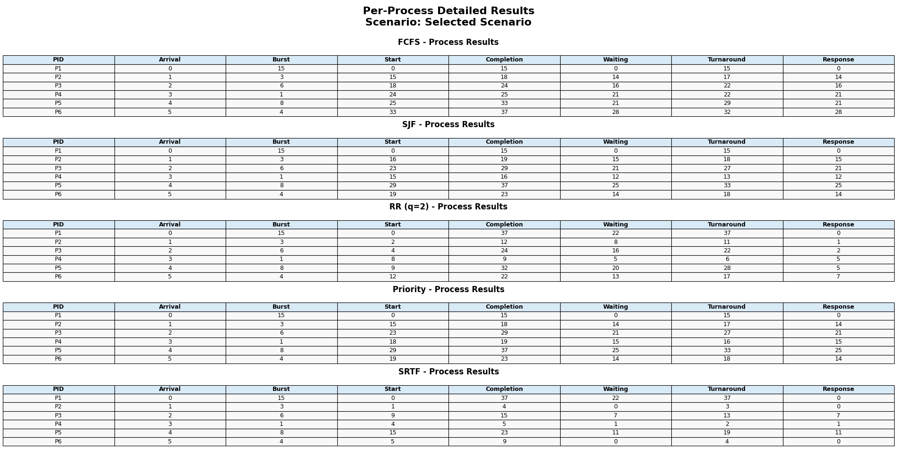
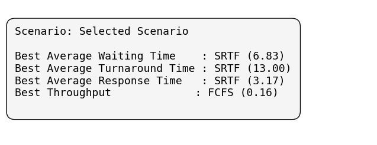

# Process Scheduler Performance

A hands-on simulation of classic CPU scheduling algorithms, built to visualize how different strategies handle the same workload. Pick a scenario, run all five algorithms side by side, and instantly compare their performance through Gantt charts, detailed result tables, and metric bar charts.

---

## Features

- **Five scheduling algorithms** — FCFS, SJF, Round Robin, Priority, and SRTF, each implemented from scratch.
- **Six built-in scenarios** — Pre-configured process sets that highlight specific scheduling behaviors (convoy effect, RR-friendly loads, priority inversion, etc.).
- **Gantt chart visualization** — Color-coded timelines showing exactly when each process runs under every algorithm.
- **Metric comparison charts** — Bar charts comparing average waiting time, turnaround time, and response time across all algorithms, with the best performer highlighted in green.
- **Per-process result tables** — Detailed breakdown of every scheduling metric for each process.
- **Summary dashboard** — At-a-glance view of which algorithm wins on each metric for the selected scenario.
- **Interactive CLI** — Simple menu-driven interface to choose scenarios and run simulations.

---

## Tech Stack

| Component       | Technology                |
|-----------------|---------------------------|
| Language        | Python 3                  |
| Data Modeling   | `dataclasses`             |
| Visualization   | Matplotlib, NumPy         |

---

## Installation

### Prerequisites

- Python 3.8 or higher
- pip

### Setup

1. **Clone the repository**

   ```bash
   git clone https://github.com/mehditalebi01/process-scheduler-performance.git
   cd process-scheduler-performance
   ```

2. **Install dependencies**

   ```bash
   pip install matplotlib numpy
   ```

---

## Usage

Run the simulation from the `main` directory:

```bash
cd main
python main.py
```

You'll see an interactive menu:

```
******** welcome to process scheduler performance simulation ********
enter sample data:
1. basic
2. convoy effect
3. rr friendly
4. priority case
5. srtf case
6. presentation
>>>
```

Enter a number (1–6) to select a scenario. The program will run all five algorithms on that process set, print detailed results to the console, and display four Matplotlib figures:

1. **Gantt Charts** — visual timeline for each algorithm
2. **Metrics Comparison** — bar charts for waiting, turnaround, and response time
3. **Results Table** — per-process breakdown for every algorithm
4. **Dashboard** — summary of the best algorithm per metric

---

## Screenshots

### CLI Menu
<p align="center">
  
</p>

### Gantt Charts
<p align="center">
  
</p>

### Metrics Comparison
<p align="center">
  
</p>

### Per-Process Results Table
<p align="center">
  
</p>

### Dashboard Summary
<p align="center">
  
</p>

---

## Project Structure

```
process-scheduler-performance/
├── main/
│   ├── main.py            # Entry point — runs all algorithms and displays figures
│   ├── process.py         # Process dataclass (pid, arrival, burst, priority)
│   ├── schedulers.py      # FCFS, SJF, Round Robin, Priority, SRTF implementations
│   ├── metrics.py         # Calculates averages and throughput from completed data
│   ├── sample_data.py     # Six pre-built process scenarios
│   └── visualization.py   # Gantt charts, bar charts, tables, and dashboard
├── screenshots/           # Output screenshots for the README
├── .gitignore
├── LICENSE
└── README.md
```

---

## Scheduling Algorithms

| Algorithm        | Type           | Description                                                                 |
|------------------|----------------|-----------------------------------------------------------------------------|
| **FCFS**         | Non-preemptive | Processes run in arrival order — simple but prone to the convoy effect.      |
| **SJF**          | Non-preemptive | Shortest job goes first — minimizes average waiting time for non-preemptive. |
| **Round Robin**  | Preemptive     | Each process gets a fixed time quantum (default: 2) before rotating.        |
| **Priority**     | Non-preemptive | Lower priority number = higher priority. Ties broken by arrival time.       |
| **SRTF**         | Preemptive     | Preemptive SJF — the process with the least remaining time always runs.     |

---

## Future Improvements

- [ ] Add support for custom user-defined process sets via CLI or file input
- [ ] Implement Multilevel Feedback Queue (MLFQ) scheduling
- [ ] Export results to CSV or PDF reports
- [ ] Add a web-based or GUI front-end for interactive exploration
- [ ] Include CPU utilization and context switch count as additional metrics

---

## Contributing

Contributions are welcome! To get started:

1. Fork the repository
2. Create a feature branch (`git checkout -b feature/your-feature`)
3. Commit your changes (`git commit -m "Add your feature"`)
4. Push to the branch (`git push origin feature/your-feature`)
5. Open a Pull Request

Please make sure your code follows the existing style and includes clear commit messages.

---

## License

This project is licensed under the [MIT License](LICENSE).
